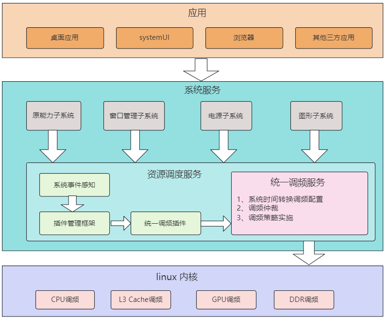

# SOC统一调频部件

## 简介
SOC统一调频部件是资源调度子系统中的部件之一，资源调度子系统提供系统事件的感知以及分发，例如应用启动、退出、亮灭屏等。详情可参考[资源调度服务](https://gitee.com/openharmony/resourceschedule_resource_schedule_service/README_ZH.md)。

SOC统一调频服务作为资源调度子系统的子模块，主要功能是从SOC统一调频插件中接收调频事件，进行相关的调频仲裁，最终使用内核接口设置CPU频率策略。其架构图示如下：

**图1** 统一调频部件架构图

 
 

 架构说明：

 1、应用调用系统服务，触发系统事件。

 2、在系统事件回调中通过统一调频提供的内部接口插入调频事件桩点。

 3、在资源调度服务中感知系统事件，转发给统一调频插件。

 4、在统一调频服务中根据系统事件查找配置，找到与其对应的调频配置，经过调频仲裁后得到最终的调频策略。

 5、统一调频模块将调频策略参数传递给内核完成调频。

## 目录
```
/foundation/resourceschedule/resource_schedule_service
├── common                        # 公共头文件
├── interfaces
│   └── inner_api                 # 对外接口目录
│       └── socperf_client        # SocPerf客户端代码，给调用者使用的接口
├── profile                       # 调频配置文件
├── sa_profile                    # 系统元能力配置
├── services
│    ├── core                     # SocPerf核心业务逻辑代码，仲裁并生效最终的调频结果
│    └── server                   # SocPerf服务端代码，用于接受客户端发送的调频请求
```
## 编译构建
编译32位ARM系统soc_perf部件：
```
./build.sh --product-name {product_name} --ccache --build-target soc_perf
```
编译64位ARM系统soc_perf部件：
```
./build.sh --product-name {product_name} --ccache --target-cpu arm64 --build-target soc_perf
```
{product_name}为当前支持的平台，比如rk3568。
## 说明
### 调频接口说明

当前可支持的调频接口说明：

| 接口  | 说明  |
|----------|-------|
| PerfRequest(int32_t cmdId, const std::string& msg) | 用于性能提频使用 |
| PerfRequestEx(int32_t cmdId, bool onOffTag, const std::string& msg) | 用于性能提频使用且支持ON/OFF事件 |
| PowerLimitBoost(bool onOffTag, const std::string& msg) | 用于限制boost无法突破功耗限频 |
| ThermalLimitBoost(bool onOffTag, const std::string& msg) | 用于限制boost无法突破热限频 |
| LimitRequest(int32_t clientId, const std::vector<int32_t>& tags, const std::vector<int64_t>& configs, const std::string& msg) | 用于热或功耗模块的限频且支持多项值一同设置 |

如表格所示，所有的调频接口都以cmdID为核心，将调频场景和调频参数互相关联，实现提频或者限频的功能。  
带onOffTag参数的接口表示该接口支持ON/OFF的开关调频模式，一般用于生效时间不固定的长期调频事件，需要调用者手动开启或者关闭。  
msg参数为拓展字符串信息，可承载例如调用客户端pid/tid等信息。  

### 调频配置说明

当前configs目录下的配置文件：

| 配置文件  | 说明  |
|----------|-------|
| socperf_resource_config.xml | 定义产品可支持的资源配置，例如CPU/GPU/DDR/NPU等 |
| socperf_boost_config.xml | 用于性能提频的配置文件 |

各个xml配置文件都需要按产品定制，不同产品的配置不相同。  
对于指定的某产品，所有可支持配置的资源都定义在socperf_resource_config.xml内，支持单路径/多路径配置，任何资源都有唯一的resID。  
socperf_boost_config.xml使用的cmdID不能重复。  

### 调频使用举例

以点击提频事件为例。  

点击场景提频为固定生效时间，无需使用ON/OFF手动开启或关闭，故使用PerfRequest接口即可。因此需要在合适的地方调用soc_perf提供的IPC接口PerfRequest实现提频请求。  

资源调度服务对所有事件的采集有统一的入口，即资源调度框架对订阅事件的插件进行分发的机制，调频服务也依赖该机制实现对于各个需要调频的场景的感知。  

调频服务已实现为一个单独的调频插件socperf_plugin，定义在foundation/resourceschedule/resource_schedule_service/ressched/plugins/socperf_plugin目录下。  
要实现点击场景的提频，分为点击事件插桩、事件上报给资源调度框架、框架给插件分发事件、生效调频服务四个步骤。  

第一步，  
ArkUI框架子系统仓内实现了对资源调度框架提供的可动态加载接口ReportData的封装，路径为/framework/base/ressched/ressched_report.h
并在/framework/core/gestures/click_recognizer.cpp增加了打点作为手势识别中对点击事件的判定。

第二步，  
通过动态加载libressched_client.z.so，调用资源调度框架提供的接口ReportData，ACE子系统将点击事件上报给全局资源调度子系统。  

第三步，  
在资源调度框架里，点击事件类型定义在/ressched/interfaces/innerkits/ressched_client/include/res_type.h内，为RES_TYPE_CLICK_RECOGNIZE  
由于调频插件socperf_plugin在初始化过程中已完成了对该点击事件的订阅，因此框架会在接受到事件通知时将点击事件分发给调频插件。  

第四步，  
调频插件socperf_plugin对于点击事件分配了cmdID：PERF_REQUEST_CMD_ID_EVENT_CLICK，路径在/ressched/plugins/socperf_plugin/src/socperf_plugin.cpp下  
通过调用调频服务提供的IPC接口PerfRequest，插件会给调频服务发送请求，实现点击提频功能。


## 相关仓

[资源调度服务子系统](https://gitee.com/cuijiawei2022/resourceschedule_resource_schedule_service/README_ZH.md)